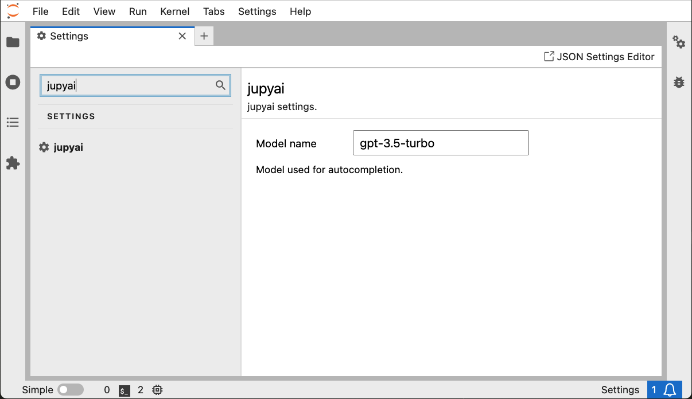

# JupyAI

[](https://github.com/ploomber/jupyai/actions/workflows/build.yml)


JupyAI adds AI capabilities to JupyterLab:

- Code generation (generate code based on a prompt)
- Code modifications (update existing code)
- Code fixing (fix broken code)

https://github.com/ploomber/jupyai/assets/989250/18447b68-3ee2-434e-b626-18fc35cb822f

## User notes

To switch the model (defaults to `gpt-3.5-turbo`), open JupyterLab preferences, type JupyAI and you'll see
a text field to change the model name. For example, to switch to GPT-4, enter `gpt-4`.

To see the valid values, consult
[OpenAI's documentation.](https://platform.openai.com/docs/models/overview)



## Development notes

- The prompts are hardcoded, it'd be better to add an option to customize them
- Only OpenAI is supported for now

PRs welcome!

## Requirements

- JupyterLab >= 4.0.0

## Install

```bash
pip install jupyai
```

## Usage

```bash
# set your OpenAI key
export OPENAI_API_KEY=YOURKEY

# start JupyterLab
jupyter lab
```

Once installed, you'll see a magic wand on each cell, click it to trigger code completion. You can also use CMD + ENTER (see demo at the top of this file).

## Uninstall

To remove the extension, execute:

```bash
pip uninstall jupyai
```

## Troubleshoot

If you are seeing the frontend extension, but it is not working, check
that the server extension is enabled:

```bash
jupyter server extension list
```

If the server extension is installed and enabled, but you are not seeing
the frontend extension, check the frontend extension is installed:

```bash
jupyter labextension list
```

## Contributing

See [CONTRIBUTING.md](CONTRIBUTING.md)

## Alternatives

[Jupyter AI](https://github.com/jupyterlab/jupyter-ai) is another extension that
brings AI capabilities to Jupyter. It has a lot of great features!

However, Jupyter AI generates code in the cell's output; hence, you need to copy-paste
code if you want to run it or if you want to update existing code. JupyAI adds
code to the cell itself, allowing you to edit it and run it as you'd normally do.
